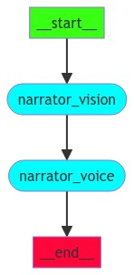

## NVIDIA AI Dev Contest

### Project: MMA AI Narrator

### Objective
Develop a generative AI system to provide engaging and dramatic narration for MMA fights.

### Use Case
Mixed Martial Arts (MMA) fights.

### Future Applications
- AI-generated training for MMA fighters to analyze fights, movements, and decision-making.
- Detailed feedback on fight techniques and strategies.

### Technology Limitations
- Lack of specialized visual models trained on MMA fights.
- Current computer vision models may struggle to accurately detect fight techniques.
- LLMs require fine-tuning with MMA-specific texts for optimal performance.

### Tech Stack
- **LangChain & LangGraph**
- **Async runtimes**
- **NVIDIA NIM Endpoints:**
  - Vision Model: adept/fuyu-8b
  - LLM Model: llama3-70b-instruct

### MultiAgent System Graph

### System Architecture

### System Overview
An AI-driven system that provides real-time commentary for MMA fights by analyzing footage and generating informative and engaging commentary.

### Functionalities
- Analyze fight frames to extract relevant events and actions.
- Generate detailed commentary describing moves, techniques, and critical moments.
- Stream commentary as audio for real-time broadcasting.
- Enhance commentary with dramatic and emotional elements.

### Integration
- **Sports Streaming Platforms**: Enhanced viewing experiences with real-time AI commentary.
- **Educational Platforms**: Detailed explanations and analysis of fight techniques.
- **Social Media Platforms**: Share AI-generated commentary clips of significant moments.
- **Sports Analysis Tools**: Detailed AI-generated fight analysis for deeper insights.

### Use Cases
- **Personal**: MMA enthusiasts enjoy detailed commentary without traditional broadcasters.
- **Developers**: Create advanced AI systems for video content analysis.
- **Companies**: Sports broadcasters use real-time AI-generated commentary for live events.
- **Sports Analysts**: Gain detailed insights into fights with AI-generated commentary.
- **Educational**: Train MMA techniques and strategies using AI-generated explanations.